# Objetivos de la Web

Esta web de Crowfunding llamada **CrowdBoost** tiene como objetivo principal de **financiar el viaje de final de curso** de 2º de Bachillerato del IES Sant Pedro. A través de esta plataforma, se busca recaudar fondos para que los estudiantes puedan realizar un viaje educativo y cultural a Roma.

## Tipo de Web

La web es una plataforma de crowdfunding diseñada para facilitar las donaciones y mantener informados a los usuarios sobre el progreso de la campaña. Está estructurada en varias secciones que proporcionan información detallada sobre el proyecto, opciones de donación y testimonios de apoyo.

## Secciones del HTML

1. **Navbar**: Contiene el nombre del proyecto "CrowdBoost" y un menú de navegación con enlaces a las diferentes secciones de la página: Sobre el Viaje, Progreso, Apoyar, y Opiniones.

2. **Hero Section**: Presenta un mensaje principal con un único **h1** y es motivador para invitar a los usuarios a apoyar la campaña. Incluye un botón de llamada a la acción (CTA) que dirige a la sección de donaciones.

3. **Sobre Nuestro Viaje**: Proporciona detalles sobre el viaje, incluyendo los objetivos educativos y culturales, la duración del viaje, y la fecha límite para recaudar los fondos necesarios.

4. **Progreso de la Campaña**: Muestra el progreso de la recaudación de fondos mediante una barra de progreso y un texto que indica la cantidad recaudada hasta el momento.

5. **Apoya Nuestro Viaje**:Es un aside fijo que incluye un formulario para que los usuarios puedan realizar sus donaciones. Los usuarios pueden seleccionar la cantidad a aportar y elegir una recompensa en función de su donación.

6. **Lo que Dicen Sobre Nuestro Proyecto**: Presenta testimonios de personas que apoyan el proyecto, incluyendo citas de una profesora y un estudiante.

7. **Footer**: Contiene información de derechos de autor y enlaces a la política de privacidad, términos y condiciones, y una página de contacto.

Esta estructura permite a los usuarios navegar fácilmente por la web, obtener toda la información necesaria sobre el proyecto y realizar sus donaciones de manera sencilla.

# CrowdBoost - Web de Crowdfunding

## Mapa Conceptual de la Estructura

Este mapa conceptual muestra la estructura completa de la web de crowdfunding CrowdBoost, incluyendo todas las secciones y sus componentes principales.

```mermaid
%%{init: {
  'theme': 'base',
  'themeVariables': {
    'primaryColor': '#FF9900',
    'primaryTextColor': '#fff',
    'primaryBorderColor': '#FF9900',
    'lineColor': '#F8B229',
    'secondaryColor': '#006699',
    'tertiaryColor': '#669900'
  }
}}%%
flowchart TD
    classDef header fill:#FF6B6B,stroke:#FF6B6B,color:white
    classDef main fill:#4ECDC4,stroke:#4ECDC4,color:white
    classDef footer fill:#96CEB4,stroke:#96CEB4,color:white
    classDef section fill:#FFD93D,stroke:#FFD93D,color:black
    classDef content fill:#6C5B7B,stroke:#6C5B7B,color:white
    classDef feature fill:#45B7D1,stroke:#45B7D1,color:white

    A[CrowdBoost - Web de Crowdfunding]:::header --> B[Header]:::main
    A --> C[Main Content]:::main
    A --> D[Footer]:::main
    
    B --> B1[Logo: CrowdBoost]:::content
    B --> B2[Navegación Principal]:::content
    B2 --> B2a[Sobre el Viaje]:::feature
    B2 --> B2b[Progreso]:::feature
    B2 --> B2c[Apoyar]:::feature
    B2 --> B2d[Opiniones]:::feature

    C --> C1[Hero Section]:::section
    C1 --> C1a[Título Principal]:::content
    C1 --> C1b[Mensaje Motivador]:::content
    C1 --> C1c[Botón CTA]:::content

    C --> C2[Sobre el Viaje]:::section
    C2 --> C2a[Descripción del Grupo]:::content
    C2 --> C2b[Objetivos]:::content
    C2b --> C2b1[Visitar monumentos]:::feature
    C2b --> C2b2[Aprender cultura]:::feature
    C2b --> C2b3[Fortalecer lazos]:::feature
    C2 --> C2c[Detalles]:::content
    C2c --> C2c1[7 días - Junio 2025]:::feature
    C2c --> C2c2[Límite: Mayo 2025]:::feature

    C --> C3[Progreso]:::section
    C3 --> C3a[Barra de Progreso]:::content
    C3 --> C3b[Cantidad Recaudada]:::content

    C --> C4[Aside - Donaciones]:::section
    C4 --> C4a[Formulario]:::content
    C4 --> C4b[Recompensas]:::content
    C4b --> C4b1[Postal €20+]:::feature
    C4b --> C4b2[Souvenir €50+]:::feature
    C4b --> C4b3[Video €100+]:::feature

    C --> C5[Testimonios]:::section
    C5 --> C5a[Profesores]:::content
    C5 --> C5b[Estudiantes]:::content

    D --> D1[Copyright]:::content
    D --> D2[Enlaces Legales]:::content
    D2 --> D2a[Privacidad]:::feature
    D2 --> D2b[Términos]:::feature
    D2 --> D2c[Contacto]:::feature
```


### Leyenda de Colores
- 🔴 Rojo: Encabezado principal
- 🟡 Amarillo: Subsecciones
- 🟣 Púrpura: Contenidos
- 🔵 Azul: Características específicas


## Instrucciones de Instalación

### Requisitos Previos
Asegúrate de tener instalado lo siguiente en tu sistema:
- Un navegador web moderno (Chrome, Firefox, Edge, etc.)
- Git (para clonar el repositorio)

### Clonar el Repositorio
Primero, clona el repositorio de GitHub en tu máquina local. Abre una terminal y ejecuta el siguiente comando:
```bash
git clone https://github.com/tu-usuario/crowdboost.git
```

### Navegar al Directorio del Proyecto
Cambia al directorio del proyecto clonado:
```bash
cd crowdboost
```

### Abrir el Proyecto en el Navegador
Abre el archivo `index.html` en tu navegador web preferido. Puedes hacerlo directamente desde la terminal:
```bash
start index.html
```
En sistemas Unix:
```bash
open index.html
```

### Personalización
Para personalizar el proyecto, puedes editar los archivos HTML, CSS y JavaScript según tus necesidades. Asegúrate de guardar los cambios y recargar la página en tu navegador para ver los resultados.

### Despliegue en GitHub Pages
Para hacer que tu proyecto esté disponible en línea, puedes usar GitHub Pages:
1. Ve a la configuración del repositorio en GitHub.
2. En la sección "Pages", selecciona la rama `main` y la carpeta `/root`.
3. Guarda los cambios y tu proyecto estará disponible en `https://tu-usuario.github.io/crowdboost`.

¡Y eso es todo! Ahora tienes tu proyecto de crowdfunding listo para ser utilizado y compartido.